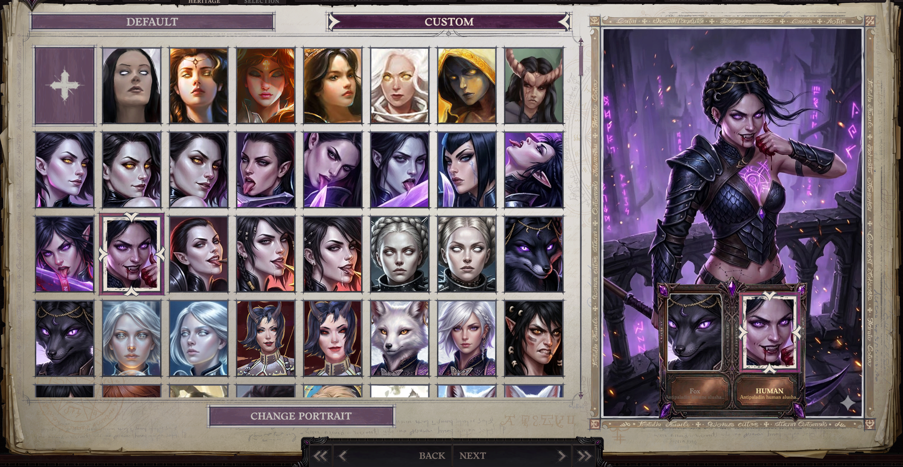

# 🇬🇧 Kitsune Portrait Mod for Pathfinder: Wrath of the Righteous

A modification for **Pathfinder: Wrath of the Righteous** that fixes the vanilla limitation where kitsune are forced to use the same portrait for both forms. The mod allows you to set **two independent portraits** for a single character: one for the fox form and one for the human form.

## Features

* **Independent Portraits:** Separate selection, binding, and saving of portraits for fox and human forms.
* **Full Compatibility:** Works correctly with both standard in-game vanilla portraits and custom user portraits from the game's folder.
* **UI Integration:** Support for configuring portraits during character creation, respec, and mythic level-ups.
* **Automatic Switching:** The character's portrait dynamically changes in-game depending on which form the kitsune is currently in.

## Screenshots

### Form Icons

  
  

### Mod Interface in char creator menu

## Installation

1. Make sure you have **Unity Mod Manager** installed for Pathfinder: WotR.
2. Download the archive with the latest version of the mod from the releases page.
3. Install the archive via Unity Mod Manager or extract the mod folder into the `Pathfinder Wrath of the Righteous/Mods` directory.

---

# 🇷🇺 Мод на портреты Кицунэ для Pathfinder: Wrath of the Righteous

Модификация для игры **Pathfinder: Wrath of the Righteous**, которая исправляет ограничение ванильной игры, где кицунэ вынуждены использовать один и тот же портрет для обеих форм. Мод добавляет возможность настроить **два независимых портрета** для одного персонажа: один для формы лисы, а второй — для формы человека.

## Особенности мода

* **Раздельные портреты:** Независимый выбор, привязка и сохранение портретов отдельно для лисьей и человеческой формы.
* **Полная совместимость:** Корректно работает как со стандартными внутриигровыми портретами, так и с пользовательскими кастомными портретами из папки игры.
* **Интеграция с интерфейсом:** Поддержка настройки портретов во время создания персонажа, респека и при повышении мифических уровней.
* **Автоматическое переключение:** Портрет персонажа в игре меняется динамически в зависимости от того, в какой форме находится кицунэ в данный момент.

## Скриншоты

### Иконки способности смена формы

  
  

### Интерфейс мода в меню создания персонажа

## Установка

1. Убедитесь, что у вас установлен **Unity Mod Manager** для Pathfinder: WotR.
2. Скачайте архив с последней версией мода со страницы релизов.
3. Установите архив через Unity Mod Manager или распакуйте папку с модом в директорию `Pathfinder Wrath of the Righteous/Mods`.
